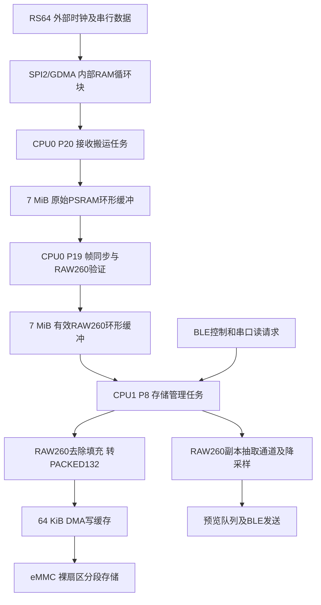

# NeuroStimRec 代码结构与简化建议

审阅日期：2026-09-08。对象是工作目录 main 的实际代码，包含尚未提交的修改。下文评估及行号以第一轮修改前为基准；第一轮实施情况见下节。未刷写设备，不把编译通过等同于板上验证。

## 第一轮修改记录（已完成）

- emmc_storage_manager.c：补充CPU/任务、两级缓冲、存储所有权和停止顺序说明；written_bytes局部改名为consumed_raw_bytes，明确为已接纳RAW260字节（可能仍在写缓存）；删除从未读取的interval_written_bytes及累加、清零两处语句。
- emmc_storage_manager.h：注明存储物理字节与有效字节、RAW260输入字节以及write_elapsed_us的实际时间含义。字段布局和对外名称保持不变。
- raw_sd_segment_recorder.h：注明写缓存为PACKED132、append接口消费RAW260、接纳不等于落盘。
- adc_preview.h：注明预览输入为RAW260、帧号从1计数、队列满不阻塞存储。
- main.c：补充启动顺序及主任务职责说明。
- 编译配置、任务优先级、缓存容量、同步算法、磁盘格式和串口/BLE协议均未改动。

验证：相对本轮修改前快照进行去注释token对比，仅有上述私有成员更名及无效计数删除；git diff --check通过；现有3项CPU查询脚本测试通过（不覆盖采集硬件）；原build目录Ninja编译、链接、固件生成及分区大小检查通过，固件大小0x97c30，最小应用分区剩余41%。ESP-IDF自带Kconfig有3条布尔默认值提示，未阻止构建。本轮未刷写或进行板上采集测试。

## 1. 先理解整体

主程序 main.c 只有35行。体量主要来自连续接收、帧同步、存储生命周期、串口可靠导出、BLE和刺激输出的并行实现。代码长不全是冗余；硬件时序、缓存所有权和失败恢复是必须明确处理的工作。

图中STORE是职责概括：代码在raw_sd_recorder_append接纳RAW260数据后调用预览抽取，接纳不表示该批数据已经全部落盘。预览仍使用原RAW260内存，不重新读取PACKED132。

## 2. 模块地图

| 模块 | 当前职责 | 初学阅读重点 |
|---|---|---|
| main.c | 初始化存储、BLE、串口、CPU监测，运行串口循环 | 启动顺序，串口最后初始化的原因 |
| emmc_storage_manager.c（1619行） | 采集任务、资源初始化、存储请求、状态发布、停止收尾 | 先读头文件、start_capture、storage_manager_task |
| continuous_rx.c（596行） | SPI/GDMA接收、描述符、完成队列、DMA块归还及异常 | 数据块由谁占用、何时可归还 |
| frame_sync.c（673行） | 连续比特流找帧、候选确认、填充检查、失步恢复 | frame_sync.h中的状态及回调契约 |
| raw_sd_segment_recorder.c（744行） | eMMC初始化、写缓存、分段、尾部补齐、元数据和恢复 | append、flush_tail、close_segment |
| raw_sd_segment_format.c/.h | 磁盘格式、版本、校验和有效性检查 | 结构大小及版本不能随意更改 |
| adc_frame_pack.h | 去除RAW260填充，保留头和64个采样值的字节顺序 | 小而独立的纯数据转换函数 |
| adc_preview.c（194行） | 通道抽取、降采样、预览队列和丢弃计数 | 预览队列满不阻塞存储 |
| ble_protocol.c（341行） | BLE消息编码、解析、CRC及组包 | 与实际无线传输分离 |
| ble_service.c（830行） | GATT、连接状态、命令处理、状态及预览发送 | 回调收命令，控制任务执行操作 |
| uart_bridge.c（718行） | 命令、元数据读取、分块导出、ACK/重试/CRC | 串口导出流程及错误分层 |
| stim_protocol.c / stim_waveform_builder.c | 刺激参数协议与波形构造 | 优先读纯逻辑，再读驱动 |
| stim_controller.c / stim_waveform.c | 刺激控制任务、LCD_CAM/GDMA硬件输出与安全停止 | 软件已接入不等于刺激硬件已验收 |
| cpu_monitor.c / cpu_monitor_math.h | 两核运行负载快照及数学计算 | 可选诊断，失败不应阻止采集 |

raw_sd_*是沿用的格式/记录器命名。本项目这些模块实际驱动eMMC，不意味着这份固件同时实现两套独立的SD与eMMC路径。

## 3. 实际采用的编程思想

| 思想 | 本项目中的具体实现 | 用途 |
|---|---|---|
| FreeRTOS多任务和优先级 | 接收P20、解析P19、存储P8、BLE控制P5 | 让及时性要求不同的工作分别调度 |
| 双核职责分配 | CPU0接收/解析，CPU1存储/BLE/刺激控制 | 减少存储及通信对接收解析的直接抢占，但仍共享内存和总线 |
| 生产者—消费者流水线 | DMA任务生产原始块，解析任务消费并生产有效帧，存储任务消费有效帧 | 缓冲各阶段速度波动 |
| 中断与任务分工 | GDMA ISR检查描述符并投递完成项，任务做后续处理 | 不是在中断中直接写eMMC；ISR内仍有必要的边界和错误检查 |
| 所有权管理 | DMA块有DMA_OWNED、CPU_READY、CPU_PROCESSING状态 | 防止硬件覆盖CPU尚未消费的数据 |
| 单一存储所有者 | 存储任务通过请求队列统一执行读写和重初始化 | 减少多个调用方争抢卡和写缓存 |
| 有限状态机 | 存储IDLE/WRITING/FINALIZING/READING/ERROR；同步ACQUIRE/COHORT/LOCKED/HOLDOVER/FATAL | 明确合法操作及出错后的动作 |
| 消息传递与同步 | Queue传命令和完成项，任务通知唤醒/返回结果，信号量确认任务停止 | 减少轮询和无序共享操作 |
| 互斥、临界区与快照 | 状态互斥锁、ISR临界区；预览generation配合配置快照 | 保护跨任务状态，同时避免逐帧加跨核锁 |
| 有界内存与批处理 | 4×32736字节DMA块、两级7MiB环、125帧批次、64KiB写缓存 | 控制内存上限、摊薄调用开销，吸收短时写入延迟 |
| 分层和回调解耦 | 同步器通过有效帧/事件回调交付结果；协议编码与服务分开 | 纯逻辑可独立测试，不必依赖整机 |
| 故障隔离与首次错误保留 | 预览允许丢弃并计数，采集关键路径溢出触发失败，记录首个错误 | 保住关键数据路径，便于定位最早故障 |
| 协作式停止和排空 | 停接收、等DMA退出、继续排空解析和有效环，最后写尾部/元数据 | 停止不是直接删任务或清缓存 |
| 版本化和检查点 | RAW260版本2、PACKED132版本3；双超级块、generation及周期元数据提交 | 识别旧数据和选择可用元数据；不保证断电时未提交尾部不丢失 |
| 可靠传输协议 | 串口包序号、CRC、ACK和有限重试 | 保护导出传输，不能证明接收前的ADC采样值正确 |

应用任务表（ESP-IDF和NimBLE还有系统任务，下面不是全部任务）：

| 任务 | 核 | 优先级 | 来源 |
|---|---:|---:|---|
| ADC_DMA_TASK | 0 | 20 | emmc_storage_manager.c:1435 |
| FRAME_PARSER_TASK | 0 | 19 | emmc_storage_manager.c:1451 |
| EMMC_STORAGE | 1 | 8 | emmc_storage_manager.c:1477 |
| BLE_CONTROL | 1 | 5 | ble_service.c:780，常量在36行 |
| stim_ctrl | 1 | 8 | stim_controller.c:89 |
| CPU_MONITOR | 1 | 1 | cpu_monitor.c:92，可配置关闭 |

## 4. 可以简化的具体位置

### A. 低风险，适合第一轮

1. **删除经全目录查证的无效内部计数。** emmc_storage_manager.c:59的interval_written_bytes仅在209行累加、827行清零，没有读取。它是私有上下文成员，当前速率计算使用last_input_bytes等差分。它是明确的冗余候选；单独删除字段及两处写入，再检查编译和日志即可。不要由此扩大成删除所有诊断计数。
2. **澄清字节单位和名称。** 同文件written_bytes实际累计RAW260消费字节，不能按eMMC实际写入字节解释。优先补单位注释，再局部改名为consumed_raw_bytes。adc_preview.c:11的260与frame_sync.h:11的260同义，可以从一个格式定义引入，并用静态断言约束。不要把接收260和存储132合为一个常量。
3. **增加模块入口说明和资源所有权表。** 不改变执行行为，让读者先看数据流、线程归属、谁释放什么，再进入具体函数。

### B. 中风险，分阶段做

4. **拆分最大的管理文件。** 第一轮只把初始化内部步骤提炼成命名函数，保持分配顺序和调用顺序；第二轮才考虑独立capture_pipeline模块。最终管理器保留状态和请求，流水线模块保留DMA/解析任务与缓存，诊断模块负责快照和格式化。禁止第一轮顺便换队列、合并任务或减缓存。
5. **整理初始化失败回滚。** init在1250行附近开始，资源多、分支多，失败时释放不完全一致。可建立资源获取清单，统一按已获取资源的逆序释放。必须覆盖“任务尚未创建”“只创建DMA任务”等阶段，并保证先停任务再释放其内存。当前启动失败会进入ESP_ERROR_CHECK失败路径，不能把这描述成已复现的正常运行泄漏；主要问题是维护及未来重试语义。
6. **提炼元数据副本选择的纯逻辑。** recorder的load_latest_superblock（73行）与uart_bridge的load_superblock（197行）都有副本验证和generation比较。只考虑共享选副本规则。UART读取有重试、card_error处理，不能把两个完整读取函数机械合并。
7. **整理BLE业务执行与GATT回调。** 协议层已经分离，不必重写；可把较长的状态组装、预览批次发送提炼为明确职责的内部函数。队列深度、执行线程和断连处理顺序保持不变。

### C. 这轮不建议以“变短”为目的改动

- continuous_rx.c的描述符扫描、所有权归还和ISR。少几行判断可能变成低概率丢块。
- frame_sync.c的候选确认和失步恢复；不能简化为搜索一次FFFF0000就永久锁定。
- 启动分配顺序。代码明确先初始化卡，再分配ADC DMA块/任务栈，以避免DMA内部RAM不足。
- RAW260转PACKED132的位置。当前在CPU1存储侧完成，不能未经测试搬到CPU0解析任务。
- 停止时排空流程（emmc_storage_manager.c:582）。等待解析退出时还要消费有效环，不能改成先干等解析结束再开始写。
- 存储API前置状态检查与handle_request中的再次检查。排队期间状态可能改变，第二次检查不是可随意删除的重复。
- 串口重试、校验、尾部72字节这类边界处理，以及元数据结构/枚举的历史取值。
- 为减少文件数量把刺激驱动合并进存储管理器；这会扩大职责耦合。

## 5. 两个特别容易误改的接口

submit_request（emmc_storage_manager.c:887）把栈上result地址交给队列，然后等待通知。它的生命周期依赖同步等待。不能仅将portMAX_DELAY换成短超时然后直接返回，否则存储任务之后可能写入失效的栈地址。若要超时，应单独设计请求生命周期、取消和回复机制。

该接口还使用调用任务的默认通知槽。以后给同一个调用任务新增其他通知用途时，要审查是否会相互消费通知；不要把它当成可任意调用的通用异步RPC。

## 6. 现有诊断和仍需补的指标

已有：原始输入字节、接纳帧、存储有效/物理字节、DMA块及描述符异常、序号缺口、两级溢出、帧头/填充错误、同步事件、预览produced/dropped、两核CPU负载。

log_write_rate（774行）有阶段吞吐和raw_free/valid_free瞬时值。不过uart_bridge.c:680在配置使用UART0时关闭普通日志，实际测试需要核对日志是否能收到，或者通过查询接口取数，不能在二进制导出串口上随意插入日志。

需要澄清：update_status_progress中的write_elapsed_us直接赋值wall_elapsed_us（880行）。它是采集经过时间，不是sdmmc_write_sectors的累计耗时，也不是最大单次写入延迟。当前代码没有完整的单次写入P99/最大值和缓存历史峰值统计；若做性能测试，需要单独加轻量计数，避免在高频路径打印。

## 7. 如何降低重构引入问题的风险

1. 先固定当前工作目录作为基线。当前已有未提交修改，不用git reset或覆盖文件来恢复所谓原版。
2. 每轮只改一个问题。名称/注释、无效字段、内部函数提炼、资源清理、跨文件拆分应分开。
3. 纯逻辑做可重复验证：RAW260→PACKED132字节一致、旧新元数据版本、帧同步跨块与错位、串口协议响应保持一致。tests已有打包/格式、CPU数学、CPU查询脚本测试，但不覆盖整个采集与停止状态机。
4. 用同一段原始输入离线回放，比较重构前后有效帧、丢弃范围和同步事件。不要要求重新采集的模拟正弦波逐字节相同。
5. 编译链接通过之后仍需板上验证：重复启动停止、目标时长记录、BLE开关、读取互锁、导出中断重试。对比最大延迟、缓存峰值和错误计数。
6. 若没有性能问题证据，第一阶段只改善可读性，不更换运行机制。静态审阅和编译都不能证明时序行为绝对不变。

## 8. 推荐阅读顺序

main.c → emmc_storage_manager.h → 本文数据流 → storage_manager_task / start_capture / stop_pipeline_drain_and_finish → adc_frame_pack.h → raw_sd_segment_recorder_append → frame_sync.h和回调 → continuous_rx.h和块归还 → BLE和串口 → 刺激驱动。

用于汇报可概括为：系统采用FreeRTOS双核多任务，通过DMA、生产者—消费者缓存流水线、状态机及统一存储管理完成连续采集。BLE预览和控制与主存储路径分开处理，裸扇区分段格式和可靠导出协议支持数据读取与诊断。
